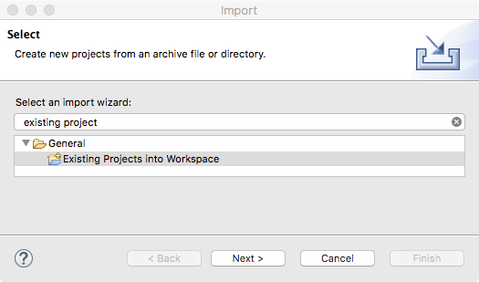

*阅读本文的其他语言版本：[English](README.md)。*

[](https://travis-ci.org/IBM/java-microprofile-config)

# 使用 MicroProfile Config API

本存储库中的应用程序将演示 [Open Liberty](https://openliberty.io/) 上的 [MicroProfile Config API](http://microprofile.io/project/eclipse/microprofile-config) 的特性。本 code pattern 包括如何使用依赖注入来接收包括动态配置和转换器在内的配置。

大部分应用程序都需要根据运行环境进行配置。必须能够从应用程序外部修改配置数据，这样就无需重新打包应用程序本身。

配置数据可能来自不同位置，并且具有不同格式。例如，系统属性、系统环境变量、属性文件或资源、XML 文件或资源，甚至是数据源。MicroProfile Config 将这些配置数据源称为 ConfigSource。因为同一个配置属性可以在多个 ConfigSource 中定义，所以可以使用优先级来确定为该配置属性值使用哪个 ConfigSource。

有时，可以动态更改配置值。应用程序需要能够在不必重新启动的情况下访问最新的配置值。这对在云环境中运行的微服务特别重要。MicroProfile Config 支持动态更新配置值。

[MicroProfile](http://microprofile.io) 是一个基准平台定义，它针对微服务架构优化了 Enterprise Java，还提供了多个 MicroProfile 运行时之间的应用程序可移植性。[Microservice Builder](https://developer.ibm.com/microservice-builder/) 提供了使用 Java 和基于 MicroProfile 的编程模型和工具来开发、测试和部署微服务的方法。

## 包含的组件
- [MicroProfile Config API](http://microprofile.io/project/eclipse/microprofile-config)
- [Open Liberty](https://openliberty.io/)
- [MicroProfile](http://microprofile.io)

## 前提条件

* 用于获取样本代码的 Git 客户端。
* 用于构建和运行代码的 JDK 8。

## 步骤

1. [获取并构建样本代码](#1获取并构建样本代码)
1. [更改上下文根目录和端口（可选）](#2更改上下文根目录和端口可选)
1. [启动应用程序](#3启动应用程序)
1. [使用 MicroProfile Config API](#4使用-microprofile-config-api)

# 1.获取并构建样本代码

首先，克隆该存储库。

```console
$ git clone https://github.com/IBM/java-microprofile-config.git
$ cd java-microprofile-config
```

然后，使用 Gradle 构建代码。此存储库还将运行测试来确保所有功能都工作正常。该存储库包含 Gradle Wrapper `gradlew`，如果您的系统上没有安装 Gradle，您可以使用 Gradle Wrapper `gradlew`。

```console
$ ./gradlew build

BUILD SUCCESSFUL in 14s
10 actionable tasks: 10 executed
```

如果您想将代码导入到一个 Eclipse 项目中，可以运行 Gradle `eclipse` 任务来创建 Eclipse 元数据。如果您更改 `build.gradle` 文件中的项目依赖项，可以使用 `eclipse` 任务重新创建/更新 Eclipse 元数据。

```console
$ ./gradlew eclipse

BUILD SUCCESSFUL in 0s
7 actionable tasks: 7 executed
```

然后使用 Eclipse 菜单上的 File->Import，并选择导入向导 Existing Projects into Workspace。



然后，选择您将 git 存储库克隆到的文件夹，并单击 Finish。


# 2.更改上下文根目录和端口（可选）

应用程序的上下文根目录被设置为 `Config`，http 端口被设置为 `9080`。如果您出于某种原因需要更改这些值，可按以下方式更改它们：

* 上下文根目录 - 需要在两个位置更改上下文根目录。在 [build.gradle](build.gradle) 中，更改变量 `appName`；在 [src/main/webapp/WEB-INF/ibm-web-ext.xml](src/main/webapp/WEB-INF/ibm-web-ext.xml) 中，更改 `context-root` 元素的 `uri` 属性。
* http 端口 - 在 [build.gradle](build.gradle) 中，更改变量 `testServerHttpPort`。

这个 README 文件假设您使用了原始值。所以如果您将它们更改为不同值，请确保适当调整下面的命令。

# 3.启动应用程序

要运行该应用程序，必须在 Open Liberty 服务器中启动它。这是通过 `libertyStart` 任务完成的。

```console
$ ./gradlew libertyStart
:libertyStart
The server is now running at http://localhost:9080/Config
To stop the server run './gradlew libertyStop'

BUILD SUCCESSFUL in 3s
7 actionable tasks: 4 executed, 3 up-to-date
```

如果修改该应用程序来尝试某种功能，可以构建该应用程序，并使用 `installApps` 任务将应用程序重新部署到运行的 Open Libery 服务器。


```console
$ ./gradlew installApps

BUILD SUCCESSFUL in 0s
6 actionable tasks: 5 executed, 1 up-to-date
```

使用完该应用程序后，停止 Open Liberty 服务器。

```console
$ ./gradlew libertyStop
:libertyStop

BUILD SUCCESSFUL in 0s
1 actionable task: 1 executed
```

# 4.使用 MicroProfile Config API

让我们看看如何使用 MicroProfile Config API。本存储库中的应用程序演示使用该 API 的多种方式，并提供一种使用 REST 端点访问配置信息的方式。该 REST 端点使用 JAX-RS、JSON-P 和 CDI 来实现，这些都包含在 MicroProfile 规范中。

用于查看配置信息的端点在 [application.rest.ConfigRestEndpoint](src/main/java/application/rest/ConfigRestEndpoint.java) 中实现。端点 `/rest/config` 以 JSON 表示形式返回完整的配置信息。

```console
$ curl http://localhost:9080/Config/rest/config

{
    "configSources":[
        {
            "name":"Time Config Source",
            "ordinal":600,
            "properties":{
                "time.now":"1506702957281"
            }
        },
        {
            "name":"System Properties Config Source",
            "ordinal":400,
            "properties":{
                "awt.toolkit":"sun.lwawt.macosx.LWCToolkit",
                "default.http.port":"9080",
                "default.https.port":"9443",
                "file.encoding":"UTF-8",
                "file.encoding.pkg":"sun.io",
                "file.separator":"/",
                ...
            }
        },
        {
            "name":"Environment Variables Config Source",
            "ordinal":300,
            "properties":{
                ...
                "JAVA_HOME":"/Library/Java/JavaVirtualMachines/jdk1.8.0_144.jdk/Contents/Home/jre",
                ...
            }
        },
        {
            "name":"Properties File Config Source: wsjar:file:/Users/hargrave/git/journey/java-microprofile-config/build/wlp/usr/servers/defaultServer/dropins/com.ibm.developer.code.microprofile.config-1.0-SNAPSHOT.war!/META-INF/microprofile-config.properties",
            "ordinal":100,
            "properties":{
                "application.rest.ConfigRestEndpoint.pretty":"true",
                "application.rest.LibertyRestEndpoint.greeting":"SimpleGreeting",
                "application.rest.LibertyRestEndpoint.hotspot":".*HotSpot.*",
                "foo":"bar",
                "java.vm.name":"This should be overridden by the System Properties ConfigSource"
            }
        }
    ]
}
```
## 配置源

在输出中，您将看到列出了多个配置源。它们按其 `序数` 值所表明的优先顺序列出。在返回一个配置属性值时，具有最高序数值的 ConfigSource 先于具有较低序数值的 ConfigSource 被查阅。

1. Time Config Source - 这是一个用于该应用程序的[自定义 ConfigSource](src/main/java/application/configsource/TimeConfigSource.java)。它由 [META-INF/services/org.eclipse.microprofile.config.spi.ConfigSource](src/main/webapp/META-INF/services/org.eclipse.microprofile.config.spi.ConfigSource) 资源告知 MicroProfile Config 实现。

1. System Properties Config Source - 这是一个默认 ConfigSource，使得系统属性可用作配置值。

1. Environment Variables Config Source - 这是一个默认 ConfigSource，使得系统环境可用作配置值。

1. Properties File Config Source - 这是一个默认 ConfigSource，使得资源 [META-INF/microprofile-config.properties](src/main/webapp/META-INF/microprofile-config.properties) 中的配置属性变得可用。

## 依赖注入

您将看到输出具有一种美观格式，这种格式更适合我们阅读，但计算机并不关心这一点。对 JSON 对象进行格式美化也会消耗一些计算能力。所以可以使用配置来更改是否对输出采用美观格式。配置属性 `application.rest.ConfigRestEndpoint.pretty` 是在资源 [META-INF/microprofile-config.properties](src/main/webapp/META-INF/microprofile-config.properties) 中配置的。要查看某个特定配置属性的值，可以使用端点 `/rest/config` 并将该属性名添加到 URL 末尾处。

```console
$ curl http://localhost:9080/Config/rest/config/application.rest.ConfigRestEndpoint.pretty

{
    "application.rest.ConfigRestEndpoint.pretty":"true"
}
```

查看使用了该配置属性的源代码，您可以在类 `application.rest.ConfigRestEndpoint` 中看到字段 `pretty` 中注入了配置值。

```java
package application.rest;
public class ConfigRestEndpoint {
    @Inject
    @ConfigProperty(defaultValue = "false")
    private boolean pretty;
```

注入字段时，默认配置属性名包含 Java 类名和将与配置值一起注入的字段名。如果需要一个非默认的配置属性名称，可以在 `ConfigProperty` 注解中指定一个属性名称。

```java
@ConfigProperty(name = "time.now")
```

所以，如果您编辑资源 [META-INF/microprofile-config.properties](src/main/webapp/META-INF/microprofile-config.properties) 中的 `application.rest.ConfigRestEndpoint.pretty` 属性值，将它从 `true` 更改为 `false`，并重新部署该应用程序，您可以看到输出不再具有美观的格式。

```console
$ ./gradlew installApps

BUILD SUCCESSFUL in 4s
6 actionable tasks: 5 executed, 1 up-to-date

$ curl http://localhost:9080/Config/rest/config/application.rest.ConfigRestEndpoint.pretty
{"application.rest.ConfigRestEndpoint.pretty":"false"}
```
## 转换

尽管配置属性值是 String 类型，但您往往需要其他数据类型的配置信息。MicroProfile Config 规范支持从 String 值转换为许多标准 Java 类型，包括所有原语和它们的包装器类型，一些基于时间的类型和 URL。您还可以提供自定义转换器来处理任何特殊转换需求。为了演示这一点，该应用程序包含两个自定义转换器： 

* [PatternConverter](src/main/java/application/converter/PatternConverter.java) - 将一个 String 配置属性值转换为 `java.util.regex.Pattern` 对象，以便进行模式匹配。
* [ResourceBundleConverter](src/main/java/application/converter/ResourceBundleConverter.java) - 将一个 String 配置属性值转换为一个 `java.util.ResourceBundle` 对象。更改配置属性的值会更改要使用的 ResourceBundle 名称。

这些自定义转换器由 [META-INF/services/org.eclipse.microprofile.config.spi.Converter](src/main/webapp/META-INF/services/org.eclipse.microprofile.config.spi.Converter) 资源告知 MicroProfile Config 实现。

可以看到这些自定义转换器被用在 [application.rest.LibertyRestEndpoint](src/main/java/application/rest/LibertyRestEndpoint.java) 中。端点 `/rest` 根据被自定义转换器转换为自定义类型的配置信息来显示一些输出。

```console
$ curl http://localhost:9080/Config/rest
Hello from the MicroProfile Config demonstrator application!
Running on Java VM Java HotSpot(TM) 64-Bit Server VM
Java specification version 1.8
Is HotSpot VM? true
Time[1] 2017-09-29 15:34:03.901
Time[2] 2017-09-29 15:34:04.006
Time[3] 2017-09-29 15:34:04.112
Time[4] 2017-09-29 15:34:04.218
```
## 动态属性

在上面的输出中，可以看到当前时间被输出了很多次。这是来自上面提到的自定义 ConfigSource [TimeConfigSource](src/main/java/application/configsource/TimeConfigSource.java) 的配置属性 `time.now` 的值。当您需要访问可以动态更改值的配置属性时，可使用 `javax.inject.Provider` 作为注入的配置属性的类型。 

```java
    @Inject
    @ConfigProperty(name = "time.now")
    private Provider<Long>  time;
```

每次在注入的 `Provider` 上调用 `get()`，都会检查配置属性的当前值。

## 参考资料

* [Eclipse MicroProfile](http://microprofile.io)
* [MicroProfile Config 规范](https://github.com/eclipse/microprofile-config/releases)
* [Eclipse MicroProfile 规范](https://github.com/eclipse/microprofile/releases)

# 许可

[Apache License 2.0](LICENSE)
