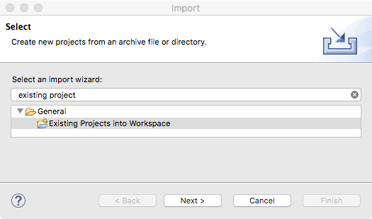
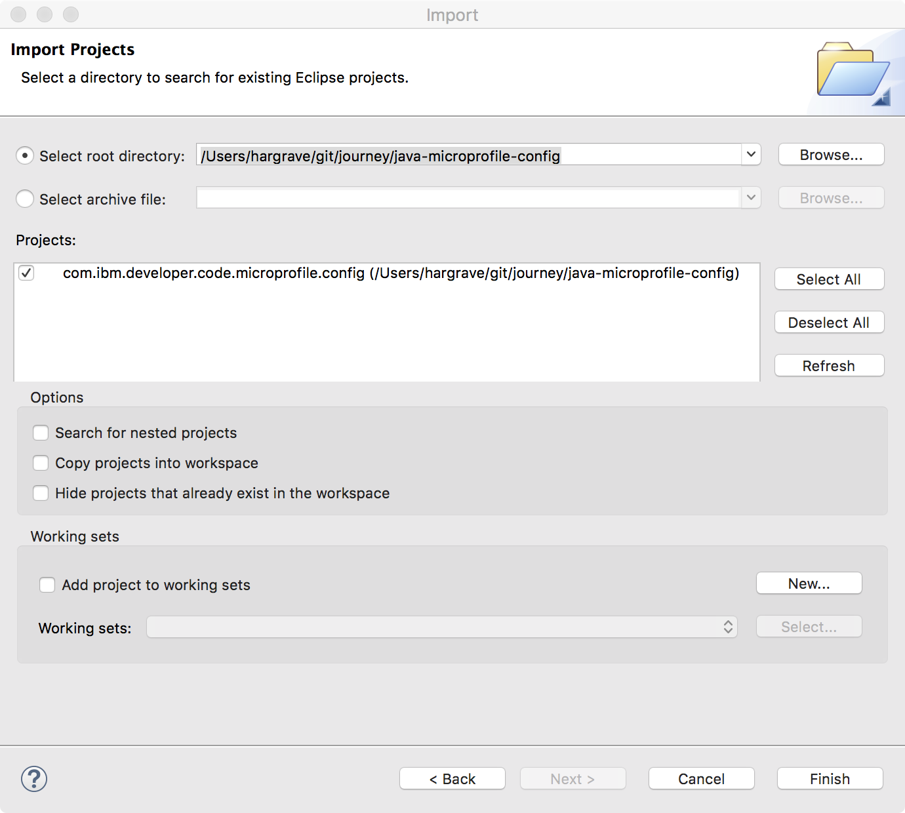

[](https://travis-ci.org/IBM/java-microprofile-config)

# Using MicroProfile Config API

The application in this repository demonstrates the features of the [MicroProfile Config API](http://microprofile.io/project/eclipse/microprofile-config) on [Open Liberty](https://openliberty.io/). The code includes using dependency injection to receive configuration include dynamic configuration and converters.

Most applications need to be configured based on a running environment. It must be possible to modify configuration data from outside an application so that the application itself does not need to be repackaged.

The configuration data can come from different locations and in different formats. For example, system properties, system environment variables, properties files or resources, XML files or resources, and even datasources. MicroProfile Config calls these sources of configuration data ConfigSources. Since the same configuration property could be defined in multiple ConfigSources, a prioritization can be used to determine which ConfigSource is used for the configuration property value.

Sometimes configuration values can change dynamically. Applications need to be able to access the latest configuration values without the need to be restarted. This is particularly important for microservices running in a cloud environment. MicroProfile Config support dynamically updating configuration values.

[MicroProfile](http://microprofile.io) is a baseline platform definition that optimizes Enterprise Java for a microservices architecture and delivers application portability across multiple MicroProfile runtimes. [Microservice Builder](https://developer.ibm.com/microservice-builder/) provides means to develop, test and deploy your microservices using a Java and MicroProfile based programming model and tools.

## Included Components
- [MicroProfile Config API](http://microprofile.io/project/eclipse/microprofile-config)
- [Open Liberty](https://openliberty.io/)
- [MicroProfile](http://microprofile.io)

## Prerequisite

* Git client to obtain the sample code.
* JDK 8 to build and run the the code.

## Steps

1. [Get and build the sample code](#1-get-and-build-the-sample-code)
1. [Changing the context root and port (optional)](#2-changing-the-context-root-and-port-optional)
1. [Starting the application](#3-starting-the-application)
1. [Using the MicroProfile Config API](#4-using-the-microprofile-config-api)

# 1. Get and build the sample code

First, clone the repository.

```console
$ git clone https://github.com/IBM/java-microprofile-config.git
$ cd java-microprofile-config
```

Then, build the code with Gradle. This will also run tests to make sure everything is working properly. The repository includes the Gradle Wrapper `gradlew` which you can use if you don't have Gradle installed on your system.

```console
$ ./gradlew build
:installLiberty
:publishServerConfig
:compileJava
:processResources
:classes
:war
:publishWar
:setupServer
:libertyPackage
:assemble
:compileIntegrationTestJava
:processIntegrationTestResources NO-SOURCE
:integrationTestClasses
:libertyIntegrationTestStart
:integrationTest
:libertyIntegrationTestStop
:compileTestJava NO-SOURCE
:processTestResources NO-SOURCE
:testClasses UP-TO-DATE
:test NO-SOURCE
:check
:build

BUILD SUCCESSFUL in 14s
12 actionable tasks: 12 executed
```

If you want to import the code into an Eclipse project, run the Gradle `eclipse` task to create the Eclipse metatdata. If you change the project dependencies in the `build.gradle` file, you can use the `eclipse` task to recreate/update the Eclipse metatdata.

```console
$ ./gradlew eclipse
:eclipseClasspath
:eclipseJdt
:eclipseProject
:eclipseWtpComponent
:eclipseWtpFacet
:eclipseWtp
:eclipse

BUILD SUCCESSFUL in 0s
5 actionable tasks: 5 executed
```

And then use File->Import... on Eclipse menu and select the import wizard Existing Projects into Workspace.



Then select the folder where you cloned the git repository and click Finish.



# 2. Changing the context root and port (optional)

The context root for the application is set to `Config` and the http port is set to `9080`. If you need to change these for some reason, they can be changed as follows:

* context root - The context root needs to be changed in 2 places. In [build.gradle](build.gradle) change the variable `appName` and in [src/main/webapp/WEB-INF/ibm-web-ext.xml](src/main/webapp/WEB-INF/ibm-web-ext.xml) change the `uri` attribute of the `context-root` element.
* http port - In [build.gradle](build.gradle) change the variable `testServerHttpPort`.

This README assumes the original values are used. So if you change them to different values, make sure to adjust the commands below as appropriate.

# 3. Starting the application

To run the application, you must start it in the Open Liberty server. This is done with the `libertyStart` task.

```console
$ ./gradlew libertyStart
:installLiberty
:publishServerConfig UP-TO-DATE
:compileJava UP-TO-DATE
:processResources UP-TO-DATE
:classes UP-TO-DATE
:war UP-TO-DATE
:publishWar UP-TO-DATE
:setupServer UP-TO-DATE
:libertyStart
The server is now running at http://localhost:9080/Config
To stop the server run './gradlew libertyStop'

BUILD SUCCESSFUL in 3s
8 actionable tasks: 2 executed, 6 up-to-date
```

If you modify the application to try something out, you can build and redeploy the application into the running Open Libery server using the `publishWar` task.


```console
$ ./gradlew publishWar
:compileJava
:processResources UP-TO-DATE
:classes
:war
:publishWar

BUILD SUCCESSFUL in 0s
4 actionable tasks: 3 executed, 1 up-to-date
```

When you are done with the using the application, stop the Open Liberty server.

```console
$ ./gradlew libertyStop
:libertyStop

BUILD SUCCESSFUL in 0s
1 actionable task: 1 executed
```

# 4. Using the MicroProfile Config API

Lets take a look at using the MicroProfile Config API. The application in this repository demonstrates using the API in a number of ways of using the API and provides a way to access the configuration information using a REST endpoint which is implemented using JAX-RS, JSON-P and CDI which are all part of the MicroProfile specification.

The endpoint to view configuration information is implemented in [application.rest.ConfigRestEndpoint](src/main/java/application/rest/ConfigRestEndpoint.java). The endpoint, `/rest/config`, returns the complete configuration information in JSON representation.

```console
$ curl http://localhost:9080/Config/rest/config

{
    "configSources":[
        {
            "name":"Time Config Source",
            "ordinal":600,
            "properties":{
                "time.now":"1506702957281"
            }
        },
        {
            "name":"System Properties Config Source",
            "ordinal":400,
            "properties":{
                "awt.toolkit":"sun.lwawt.macosx.LWCToolkit",
                "default.http.port":"9080",
                "default.https.port":"9443",
                "file.encoding":"UTF-8",
                "file.encoding.pkg":"sun.io",
                "file.separator":"/",
                ...
            }
        },
        {
            "name":"Environment Variables Config Source",
            "ordinal":300,
            "properties":{
                ...
                "JAVA_HOME":"/Library/Java/JavaVirtualMachines/jdk1.8.0_144.jdk/Contents/Home/jre",
                ...
            }
        },
        {
            "name":"Properties File Config Source: wsjar:file:/Users/hargrave/git/journey/java-microprofile-config/build/wlp/usr/servers/defaultServer/dropins/com.ibm.developer.code.microprofile.config-1.0-SNAPSHOT.war!/META-INF/microprofile-config.properties",
            "ordinal":100,
            "properties":{
                "application.rest.ConfigRestEndpoint.pretty":"true",
                "application.rest.LibertyRestEndpoint.greeting":"SimpleGreeting",
                "application.rest.LibertyRestEndpoint.hotspot":".*HotSpot.*",
                "foo":"bar",
                "java.vm.name":"This should be overridden by the System Properties ConfigSource"
            }
        }
    ]
}
```
## Configuration Sources

In the output, you will see there are several configuration sources listed. They are listed in priority order as noted by their `ordinal` values. ConfigSources with the highest ordinal are consulted before those with a lower ordinal when returning a configuration property value.

1. Time Config Source - This is a [custom ConfigSource](src/main/java/application/configsource/TimeConfigSource.java) for the application. It is made known to the MicroProfile Config implementation by the [META-INF/services/org.eclipse.microprofile.config.spi.ConfigSource](src/main/webapp/META-INF/services/org.eclipse.microprofile.config.spi.ConfigSource) resource.

1. System Properties Config Source - This is one of the default ConfigSources and makes the system properties available as configuration values.

1. Environment Variables Config Source - This is one of the default ConfigSources and makes the system environment available as configuration values.

1. Properties File Config Source - This is one of the default ConfigSources and makes the configuration properties in the resource [META-INF/microprofile-config.properties](src/main/webapp/META-INF/microprofile-config.properties) available.

## Dependency Injection

You'll see the output is in pretty format which is nicer for us to read but computers don't care. It also takes some computing power to pretty format the JSON object. So you can use configuration to change whether the output is in pretty format. The configuration property `application.rest.ConfigRestEndpoint.pretty` is configured in the resource [META-INF/microprofile-config.properties](src/main/webapp/META-INF/microprofile-config.properties). You can view the value of a specific configuration property using the endpoint `/rest/config` with the property name added to the end of the URL.

```console
$ curl http://localhost:9080/Config/rest/config/application.rest.ConfigRestEndpoint.pretty

{
    "application.rest.ConfigRestEndpoint.pretty":"true"
}
```

Looking at the source code where it uses the configuration property, you see the field `pretty` in class `application.rest.ConfigRestEndpoint` being injected with the configuration value.

```java
package application.rest;
public class ConfigRestEndpoint {
    @Inject
    @ConfigProperty(defaultValue = "false")
    private boolean pretty;
```

When injecting fields, the default configuration property name consists of the Java class name plus the field name which is to be injected with the configuration value. You can specify a property name in the `ConfigProperty` annotation if you need a configuration property name different than the default.

```java
@ConfigProperty(name = "time.now")
```

So, if you edit the `application.rest.ConfigRestEndpoint.pretty` property value in the resource [META-INF/microprofile-config.properties](src/main/webapp/META-INF/microprofile-config.properties), changing it from `true` to `false`, and redeploy the application, you can see that the output is no longer in pretty format.

```console
$ ./gradlew publishWar
:compileJava
:processResources UP-TO-DATE
:classes
:war
:publishWar

BUILD SUCCESSFUL in 4s
4 actionable tasks: 3 executed, 1 up-to-date

$ curl http://localhost:9080/Config/rest/config/application.rest.ConfigRestEndpoint.pretty
{"application.rest.ConfigRestEndpoint.pretty":"false"}
```
## Conversion

While configuration property values are of type String, you often need your configuration information in other data types. The MicroProfile Config specification supports conversion from a String value to many standard Java types including all the primitives and their wrapper types, a number of time-based types and URL. You can also provide custom Converters to handle any special conversion needs. To demonstrate this, the application includes two custom Converters: 

* [PatternConverter](src/main/java/application/converter/PatternConverter.java) - converts a String configuration property value into a `java.util.regex.Pattern` object for pattern matching.
* [ResourceBundleConverter](src/main/java/application/converter/ResourceBundleConverter.java) - converts a String configuration property value into a `java.util.ResourceBundle` object. Changing the value of the configuration property changes the name of the ResourceBundle to use.

These custom Converters are made known to the MicroProfile Config implementation by the [META-INF/services/org.eclipse.microprofile.config.spi.Converter](src/main/webapp/META-INF/services/org.eclipse.microprofile.config.spi.Converter) resource.

You can see these custom Converters being used in [application.rest.LibertyRestEndpoint](src/main/java/application/rest/LibertyRestEndpoint.java). The endpoint `/rest` displays some output based upon the configuration information converted to custom types by the custom Converters.

```console
$ curl http://localhost:9080/Config/rest
Hello from the MicroProfile Config demonstrator application!
Running on Java VM Java HotSpot(TM) 64-Bit Server VM
Java specification version 1.8
Is HotSpot VM? true
Time[1] 2017-09-29 15:34:03.901
Time[2] 2017-09-29 15:34:04.006
Time[3] 2017-09-29 15:34:04.112
Time[4] 2017-09-29 15:34:04.218
```
## Dynamic Properties

In the output above, you can see the current time is output several times. This is the value of the configuration property `time.now` from the custom ConfigSource [TimeConfigSource](src/main/java/application/configsource/TimeConfigSource.java) mentioned above. When you need to access a configuration property whose value can change dynamically, use `javax.inject.Provider` as the type of the injected configuration property. 

```java
    @Inject
    @ConfigProperty(name = "time.now")
    private Provider<Long>  time;
```

Each time you call `get()` on the injected `Provider`, the configuration property is checked for the current value.

## References

* [Eclipse MicroProfile](http://microprofile.io)
* [MicroProfile Config 1.1 specification](https://github.com/eclipse/microprofile-config/releases/download/1.1/microprofile-config-spec.pdf)
* [Eclipse MicroProfile specifications](https://github.com/eclipse/microprofile-bom/releases)

# License

[Apache License 2.0](LICENSE)
